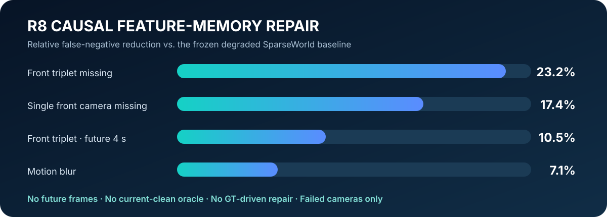
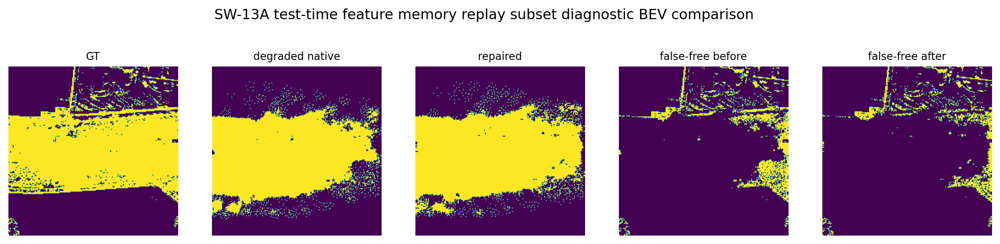
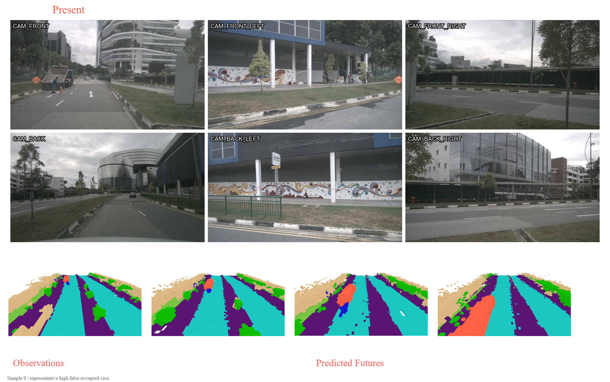
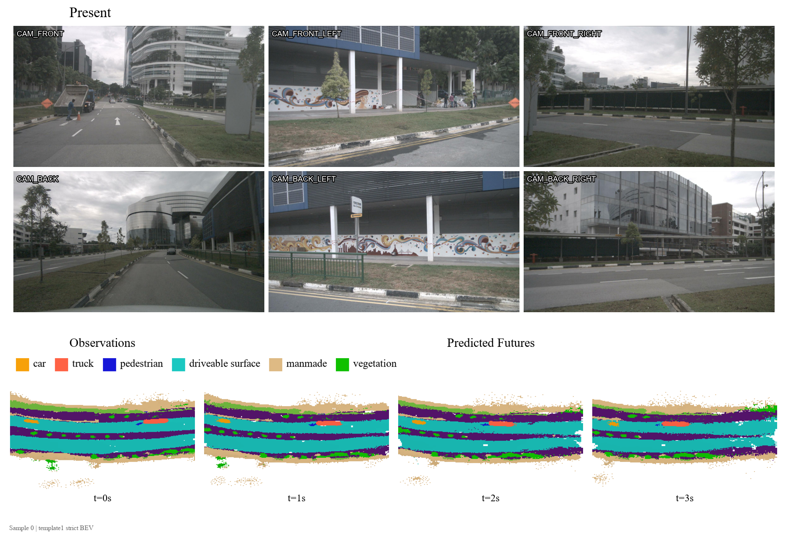
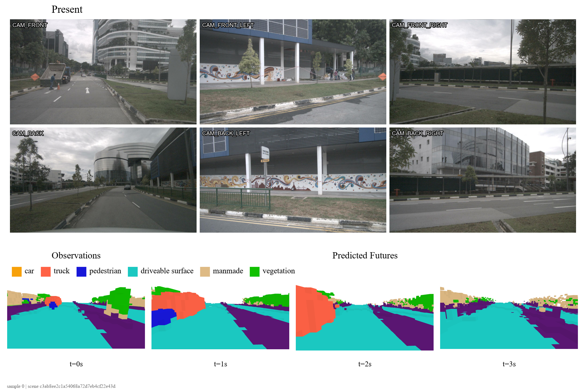
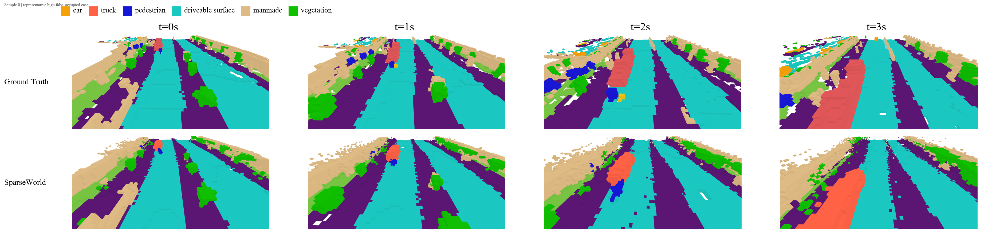
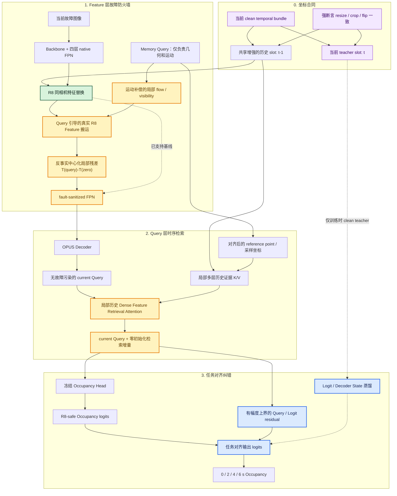

# SparseWorld 可靠性实验室

**简体中文** | [English](README_EN.md)

**面向真实传感器退化的鲁棒 4D Occupancy 系统算法项目。**

[](README_EN.md#authorized-local-evaluation)
[](https://github.com/Rexlion777/SparseWorld-4D-Occupancy/actions/workflows/core-tests.yml)
[](README_EN.md#system-at-a-glance)
[](README_EN.md#evaluation-protocol)
[](LICENSE.md)

> **许可声明：** 本仓库公开仅用于作品展示、技术审阅与招聘评估，不属于开源项目。未经书面授权，不得复制、修改、运行、转载、再发布、用于其他项目或用于 AI 训练。详见 [LICENSE.md](LICENSE.md)。

> 项目将研究型 SparseWorld 模型扩展为可审计感知系统：注入相机故障，追踪故障传播，使用因果时序记忆修复缺失相机特征，并同时评估恢复收益与虚假占据风险。



## R8 核心结果

R8 缓存上一个有效时刻的同相机 FPN 特征，仅替换当前失效的前向相机组。在冻结的退化评测协议下：

| 传感器退化 | 相对退化基线的结果 |
|---|---:|
| 前向三相机缺失 | **FN 相对降低 23.2%** |
| 前向三相机缺失，4 s 未来时域 | **FN 相对降低 10.5%** |
| 单前向相机缺失 | **FN 相对降低 17.4%** |
| 运动模糊 | **FN 相对降低 7.1%** |
| 占据密度扩张 | **控制在 +2.3% 至 +6.0%** |

这些是故障恢复结果，不是 nuScenes 榜单结果。



## 系统概览

- 每个样本 **30 张图像**：5 个时序帧 × 6 个环视相机。
- **1,040 个 Query** 表示 200 × 200 × 16，即 **640,000 个体素**。
- 输出 0 s、2 s、4 s、6 s 的语义占据。
- 故障集覆盖相机缺失、前向三相机缺失、后向相机缺失、运动模糊和低照度。
- 评测包含分区域、分类别、分时域 FN/FP，Occupancy 密度、时序稳定性与延迟。

## Template 1 四种可视化

| 环视观测 + 未来 Occupancy | Strict BEV |
|---|---|
|  |  |
| **前视/自车视角** | **GT 与 SparseWorld 时序对比** |
|  |  |

## Robot 当前工作的只读审计

2026-07-14 对 Robot 工作区进行了只读审计，未复制和提交其源码。当前方法主线为：

```text
历史 Query 记忆
→ 自车运动补偿
→ 相机投影与置信度加权 splat
→ 四层 FPN 重建/局部残差/时序传输或检索
→ R8 故障相机特征
→ 冻结 Occupancy Head
→ 特征与任务梯度对齐审计
```

审计结论：

1. 四层 FPN 重建契约、健康相机原样透传和零初始化一致性均已验证。
2. 特征重建误差降低，但 Occupancy 任务收益未能在独立窗口稳定泛化。
3. 特征损失与任务损失的平均梯度余弦为 `-0.487` 和 `-0.256`，审计窗口中负梯度比例均为 100%。
4. PCGrad 能去除直接对立分量，但仍未通过预注册的泛化和 false-free 门槛。

因此，**R8 仍是当前有证据支持的主线**。Q2F、残差、传输、检索和 PCGrad 作为研究证据保留，不冒充成功提升。完整公式、因子设计和结果见 [MCQM × R8 双语只读审计](docs/ROBOT_READONLY_AUDIT.md)。

### 下一代递进架构：Feature 防火墙 → 任务对齐检索

下图是**递进式候选架构**，不是已证实的提升结果。它保留原有 R8 主线，并严格限定每种信息源的职责。



核心结构约束：

$$
F_t^{safe}=F_t^{transport}+M_Q\odot\alpha\,H\!\left(F_t^{transport},T(S(Q))-T(S(0))\right),
\quad \alpha=\alpha_{max}\tanh(a),\ a_0=0,
$$

$$
Q_t^{out}=Q_t^{base}+W_o\mathrm{Attn}\!\left(Q_t^{base},K(F_{t-1}^{clean}),V(F_{t-1}^{clean})\right),
\quad W_{o,0}=0,
$$

$$
z_t^{out}=z_t^{R8}+\beta\,\Delta z(Q_t^{out}),\quad \beta_0=0.
$$

这些结构在初始化时建立五个 no-regret 合同：严格复现 R8；Query 清零时残差为零；support 外修改为零；健康相机原样保留；关闭检索时严格退化为 Feature 路线。

**创新点：** R8 负责真实视觉内容，Memory Query 负责几何与运动，current Query 仅请求局部历史证据，Logit Residual 负责最终任务修正。这避免让稀疏 Query 凭空生成 256 通道 Dense Feature，也防止 Attention 重复回放整张 `t-1` FPN。

## 项目代码与实验量

仓库保留 31 个有技术递进关系的实验阶段，约 5.6 万行 Python 代码，包含：

- SW1–SW4：模型 bring-up、几何、Query support 与语义激活。
- SW5–SW7：传感器故障注入、传播诊断与可靠性图。
- SW8–SW12：定向微调、贡献者路由与安全修复。
- SW13：因果特征记忆、密度约束与 R8 规模验证。
- SW14：可学习门控、残差、重排与负结果审计。
- MCQM/SWVIS：运动补偿 Query 记忆和 Template 1/4D 可视化。

建议从 [源码地图](docs/CODE_MAP.md) 开始阅读。

## 仓库结构

```text
SparseWorld-4D-Occupancy/
├── src/sparseworld_reliability/   # 轻量可测试可靠性核心
├── tests/                         # 因果、形状与指标契约
├── scripts/lidar_system_algorithm/
│   └── sparseworld_mainline/       # 31 个真实实验阶段
├── docs/                          # 架构、实验、结果、可复现性与只读审计
├── assets/                        # Template 1 与 R8 证据画廊
└── external/SparseWorld           # 上游子模块
```

## 授权后的本地评测

以下命令仅供已获得仓库所有者书面授权的评测者使用，并不构成公开使用许可。

```bash
git clone --recurse-submodules https://github.com/Rexlion777/SparseWorld-4D-Occupancy.git
cd SparseWorld-4D-Occupancy
python -m venv .venv
source .venv/bin/activate
pip install -e ".[dev]"
pytest -q
```

完整 nuScenes/SparseWorld 链路额外需要 CUDA/MMCV 环境、数据集和 checkpoint，详见 [REPRODUCIBILITY.md](docs/REPRODUCIBILITY.md)。

## 上游归属

本项目扩展自 [MSunDYY/SparseWorld](https://github.com/MSunDYY/SparseWorld)。传感器退化、因果特征记忆、评测契约、可靠性诊断与结果解读是本项目的扩展工作。`external/SparseWorld` 上游子模块、数据集、模型权重及其他第三方材料不属于本仓库专有许可的覆盖范围，仍遵循其各自条款。

## 版权与使用限制

本仓库原创代码、实验脚本、文档、图表和可视化资产采用 **Source-Available · All Rights Reserved** 专有声明。公开可见不代表允许复用；除 GitHub 平台条款或适用法律明确赋予的权利外，未授予复制、修改、运行、分发、商用、学术复现或 AI 训练许可。完整条款见 [LICENSE.md](LICENSE.md)。
