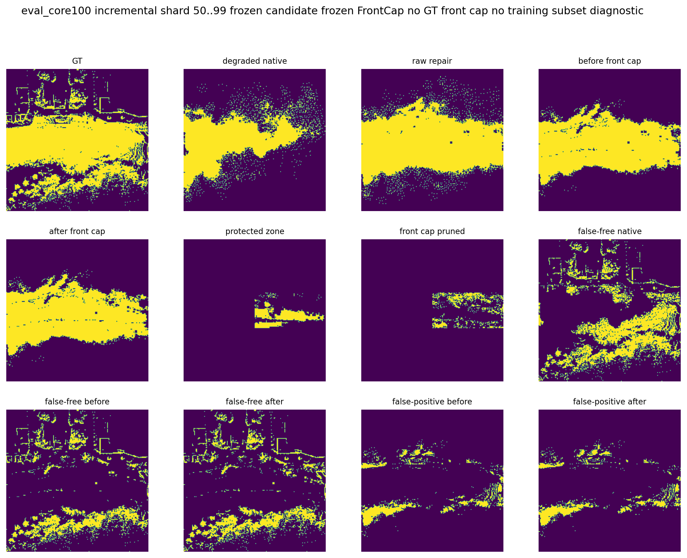
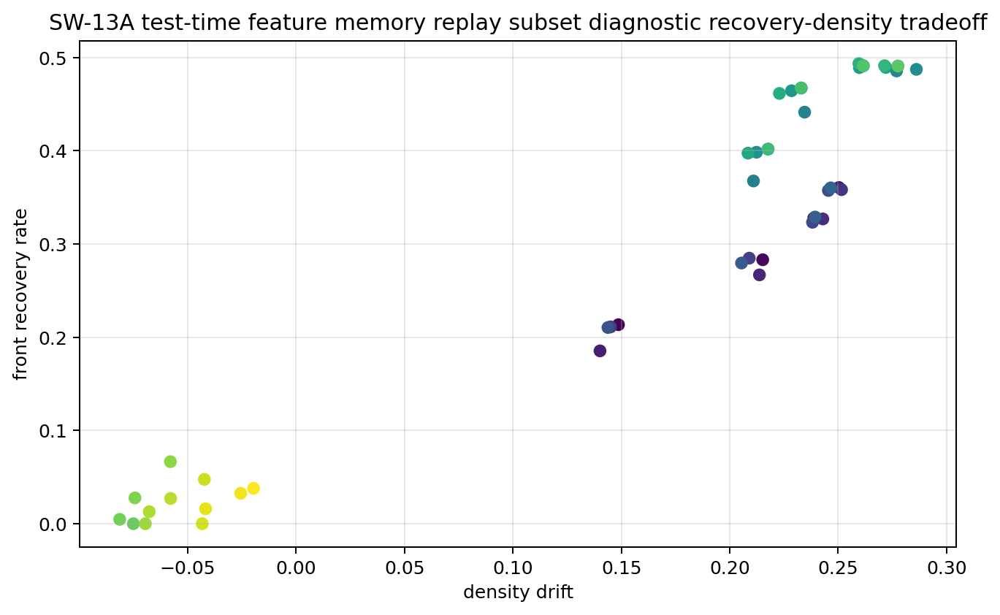
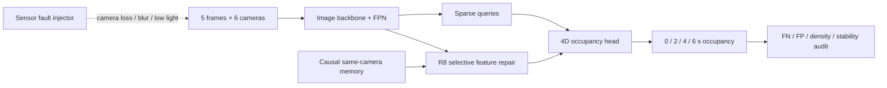
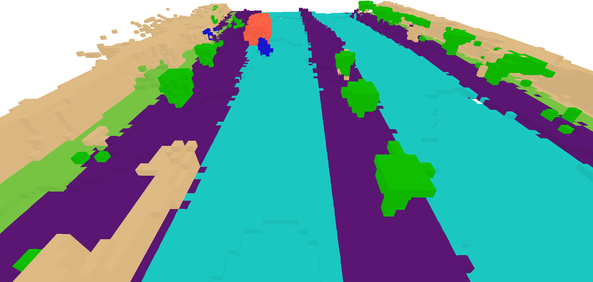
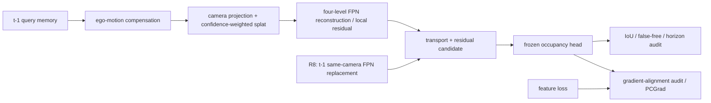

# SparseWorld Reliability Lab

**English** | [简体中文](README_zh-CN.md)

**A system-algorithm project for robust 4D occupancy under real sensor degradation.**

[](#quick-start)
[](https://github.com/Rexlion777/SparseWorld-4D-Occupancy/actions/workflows/core-tests.yml)
[](#system-at-a-glance)
[](#evaluation-protocol)
[](#causal-and-safety-contract)

> The project turns a research-grade SparseWorld model into an auditable perception system: it injects camera faults, traces failure propagation, restores missing camera features from causal temporal memory, and measures both recovery and false-occupancy risk.


## Headline result: R8 camera-group memory repair

R8 caches the last valid same-camera FPN features and replaces only the failed front-camera group before the occupancy head. On the frozen degradation evaluation suite, it achieved:

| Sensor degradation | Reliability result vs. degraded baseline |
|---|---:|
| Front triplet missing | **23.2% relative FN reduction** |
| Front triplet missing, 4 s future horizon | **10.5% relative FN reduction** |
| Single front camera missing | **17.4% relative FN reduction** |
| Motion blur | **7.1% relative FN reduction** |
| Occupancy-density expansion | **controlled to +2.3% to +6.0%** |

These are fault-recovery results, not nuScenes leaderboard claims. Metric definitions, causal constraints, and the frozen comparison protocol are documented in [RESULTS.md](docs/RESULTS.md).

### R8 visual evidence

The qualitative panels use the same frozen predictions as the metric audit. Red regions expose false-free errors; the repaired column shows what causal same-camera memory restores without reading the current clean frame or ground truth.


<details>
<summary><strong>Expanded 100-sample front-cap diagnostic</strong></summary>





</details>

## System at a glance

- **30 images per sample:** 5 temporal frames × 6 surround cameras.
- **Sparse-to-dense reasoning:** 1,040 queries represent a 200 × 200 × 16 occupancy volume (**640,000 voxels**).
- **4D output:** semantic occupancy at 0 s, 2 s, 4 s, and 6 s.
- **Reliability suite:** camera loss, front-triplet loss, rear-camera loss, motion blur, and low-light perturbations.
- **System diagnostics:** sector-, class-, and horizon-level FN/FP, occupancy density, temporal stability, and latency.



## What I built

1. **End-to-end evaluation path** — nuScenes temporal data organization, calibration loading, SparseWorld inference/fine-tuning, semantic occupancy metrics, and BEV visualization.
2. **Sensor degradation engine** — deterministic perturbations with manifests that preserve camera, frame, and severity provenance.
3. **Causal feature memory** — same-camera historical FPN cache, selective repair masks, and zero-oracle runtime behavior.
4. **Failure attribution** — region-, class-, and future-horizon analysis instead of a single aggregate score.
5. **Engineering decision loop** — preregistered thresholds, parity checks, ablations, and explicit rejection of variants that improve feature reconstruction but not occupancy quality.

## Template 1: four complementary 4D views

“Template 1” is the project-specific visualization family used to inspect the same prediction from four angles. These figures are qualitative diagnostics, not manually edited predictions or leaderboard evidence.

| 1. Surround observation + future occupancy | 2. Strict BEV projection |
|---|---|
|  |  |
| **3. Front/ego-centric view** | **4. GT vs. SparseWorld temporal rollout** |
|  |  |

<details>
<summary><strong>Animated future rollout</strong></summary>



</details>

## Read-only research snapshot: MCQM × R8

The active Robot workspace was inspected **read-only** on 2026-07-14. Its source code is intentionally not copied into this portfolio branch. The ongoing line asks whether motion-compensated sparse queries can improve R8 without sacrificing its causal, camera-selective safety contract.



The audit found three important engineering conclusions:

1. **The corrected four-FPN contract is valid:** native bypass, healthy-camera passthrough, history passthrough, and zero-initialization parity all pass.
2. **Feature reconstruction is not equivalent to task improvement:** transport/residual variants reduce feature L1 error, but their Occupancy gains do not generalize across evaluation windows.
3. **The conflict is measurable:** feature and task gradients have negative mean cosine (`-0.487` for centered/local residual and `-0.256` for transport residual), with a 100% negative fraction in the audited window. Level-wise PCGrad removes opposing components, but the preregistered task thresholds still do not pass.

Therefore, **R8 remains the supported mainline**. Full Q2F, dense residual, transport, retrieval attention, and PCGrad remain research evidence rather than claimed improvements. See the bilingual [MCQM × R8 read-only audit](docs/ROBOT_READONLY_AUDIT.md) for equations, tensor contracts, factorial design, results, and the next solution direction.

## Experiment atlas: beyond R8

R8 is the strongest headline result, but the project is a broader systems investigation rather than a single trick. The full research sequence includes:

| Track | Question | Outcome |
|---|---|---|
| Bring-up & geometry audit | Are temporal ordering, calibration, query semantics, and occupancy labels correct? | **Infrastructure established** |
| Sensor-fault propagation | Where do camera loss, blur, and low light first damage the 4D prediction chain? | **Failure taxonomy established** |
| Reliability maps | Can risk be localized by camera sector, class, distance, and future horizon? | **Diagnostic tool established** |
| Targeted fine-tuning | Does direct retraining recover fault robustness without clean-scene regression? | **Mixed; scale- and protocol-sensitive** |
| Contributor routing | Which sparse queries and support voxels actually affect failed regions? | **Useful causal evidence; limited repair gain** |
| R8 feature memory | Can causal same-camera history repair missing front views? | **Strongest supported recovery** |
| Learned gates / residuals | Can a small learned adapter improve on R8? | **Feature error improved; occupancy gain not stable** |
| MCQM / Query-to-FPN | Can motion-compensated sparse query memory reconstruct dense FPN features? | **Mechanism validated; task contribution often harmful** |
| Gradient alignment / PCGrad | Is objective conflict blocking the residual path? | **Conflict exposed; no stable replacement for R8 yet** |
| Visualization | Can 4D occupancy and support evolution be audited frame by frame? | **BEV / first-person / temporal assets produced** |

The detailed [EXPERIMENTS.md](docs/EXPERIMENTS.md) records hypotheses, evidence, and stop/continue decisions—including negative results—without pretending every experiment was a win.

## Causal and safety contract

The public core module makes the main invariants executable:

- only `t-1` or older features may be used;
- current clean images are never used to repair a degraded frame;
- ground truth is never used in repair or routing;
- only declared failed cameras may be overwritten;
- non-target cameras remain bitwise unchanged;
- clean input is a no-op.

See [`src/sparseworld_reliability/feature_memory.py`](src/sparseworld_reliability/feature_memory.py) and its focused tests.

## Repository map

```text
SparseWorld-4D-Occupancy/
├── src/sparseworld_reliability/  # clean, dependency-light reliability core
├── tests/                        # causal, shape, and metric contracts
├── scripts/lidar_system_algorithm/
│   └── sparseworld_mainline/      # 30+ real experiment stages, 56k+ lines
├── docs/
│   ├── ARCHITECTURE.md           # model and data flow
│   ├── EXPERIMENTS.md            # complete hypothesis/evidence/decision map
│   ├── RESULTS.md                # R8 protocol and result interpretation
│   ├── REPRODUCIBILITY.md        # environment and full-pipeline guidance
│   └── CODE_MAP.md               # source-level reading guide
├── assets/                       # Template 1 and R8 evidence gallery
└── external/SparseWorld          # upstream research code as a submodule
```

The source tree deliberately keeps substantial experiment code rather than only presenting a polished toy module. It covers model bring-up, geometry and query-support audits, sensor-fault propagation, targeted fine-tuning, contributor routing, R8 causal feature memory, density-constrained repair, learned residual/gating attempts, MCQM query memory, and visualization generation. Repeated caches, checkpoints, generated test output, and active unfinished Robot work are excluded.

Start with [CODE_MAP.md](docs/CODE_MAP.md): it separates the supported path from negative-result branches and explains which files are worth reading first.

## Quick start

The reliability core is intentionally independent of MMCV/MMDetection3D:

```bash
git clone --recurse-submodules https://github.com/Rexlion777/SparseWorld-4D-Occupancy.git
cd SparseWorld-4D-Occupancy
python -m venv .venv
source .venv/bin/activate
pip install -e ".[dev]"
pytest -q
```

Running the complete nuScenes/SparseWorld pipeline additionally requires the upstream CUDA/MMCV environment, dataset, and checkpoint. See [REPRODUCIBILITY.md](docs/REPRODUCIBILITY.md).

## Evaluation protocol

The R8 numbers use the same model checkpoint, sample set, perturbation definitions, post-processing, and metric implementation for native degraded and repaired inference. Hyper-parameter selection and final evaluation are separated; failed variants remain failed rather than being relabeled as improvements.

## Upstream attribution

This project extends [MSunDYY/SparseWorld](https://github.com/MSunDYY/SparseWorld), which is included as a Git submodule. The reliability pipeline, perturbation analysis, causal feature-memory repair, evaluation contracts, and result interpretation in this repository are project-specific additions. Please follow the upstream repository's license and dataset terms.
