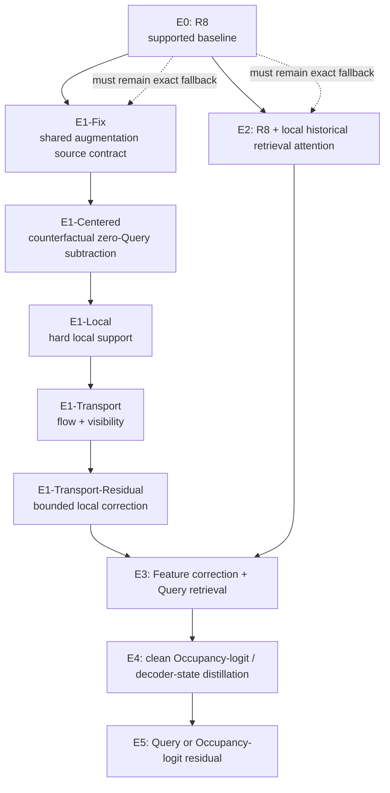

# MCQM × R8 Read-only Research Audit / 只读研究审计

> Snapshot date: 2026-07-14. The active Robot workspace was only read. No source, checkpoint, artifact, process, branch, or working-tree state was modified or copied into the portfolio branch.

> 快照日期：2026-07-14。对 Robot 正在进行的工作只进行了读取。未修改、执行、复制或提交其源码、checkpoint、产物、进程、分支或工作区状态。

## 1. Research question / 研究问题

R8 causally replaces a failed current camera's four FPN levels with the last valid same-camera FPN. The active research asks whether sparse temporal query memory can provide a more accurate correction while preserving R8's online constraints.

R8 使用上一个有效时刻的同相机 FPN，替换当前故障相机的四层 FPN。当前研究问题是：稀疏时序 Query 记忆能否在不破坏 R8 因果约束的前提下，给出更准确的修正。

## 2. End-to-end algorithm chain / 端到端算法链路

```text
t-1 camera images
  → Backbone + four FPN levels
  → SparseWorld query state {query feature, refine points, confidence, ego pose}
  → strict detached temporal memory
  → ego-motion compensation into the current ego frame
  → projection to failed cameras
  → confidence-weighted bilinear splat
  → four-level Q2F reconstruction or local residual/transport
  → overwrite failed cameras only
  → frozen Occupancy head
  → 0/2/4/6 s semantic occupancy and reliability metrics
```

中文链路：

```text
t-1 六相机图像
  → Backbone + 四层 FPN
  → SparseWorld Query 状态（特征、参考点、置信度、自车位姿）
  → 严格 detach 的历史记忆
  → 自车运动补偿到当前坐标系
  → 投影至故障相机
  → 置信度加权双线性 splat
  → 四层 Q2F 重建，或局部残差/传输
  → 仅写入故障相机
  → 冻结的 Occupancy Head
  → 0/2/4/6 s 语义占据与可靠性评测
```

## 3. Core equations / 核心公式

### 3.1 Ego-motion compensation / 自车运动补偿

For a historical query point $p_{t-1}$:

$$
p_t = T_{E_t\leftarrow G}\,T_{G\leftarrow E_{t-1}}\,p_{t-1}
    = T_{G\leftarrow E_t}^{-1}T_{G\leftarrow E_{t-1}}p_{t-1}.
$$

这一步把历史 Query 的空间位置对齐到当前自车坐标系，避免把自车运动误认为环境运动。

### 3.2 Camera projection / 相机投影

$$
\tilde p_{i,c}=K_cT_{C_c\leftarrow E_t}p_{t,i},\qquad
u_{i,c}=\tilde x/\tilde z,\quad v_{i,c}=\tilde y/\tilde z.
$$

Only positive-depth, in-frame points enter the valid support mask. / 仅深度为正且落在图像内的点可以进入 support mask。

### 3.3 Confidence-weighted query-to-FPN splat / Query 到 FPN 的加权散射

For FPN level $l$, query feature $q_i$, confidence $a_i$, and bilinear kernel $k$:

$$
S_l(x)=
\frac{\sum_i a_i^{\gamma}k(x,\pi(p_{t,i}))W_lq_i}
{\sum_i a_i^{\gamma}k(x,\pi(p_{t,i}))+\epsilon}.
$$

The sparse field and its support/weight maps are then decoded into a dense FPN candidate. / 稀疏特征与 support/weight map 共同进入 decoder，生成稠密 FPN 候选。

### 3.4 R8 baseline / R8 基线

$$
F^{R8}_{t,l,c}=
\begin{cases}
F_{t,l,c}, & c\notin\mathcal F_t,\\
F_{t-1,l,c}, & c\in\mathcal F_t,
\end{cases}
$$

where $\mathcal F_t$ is the declared failed-camera set. Healthy cameras remain bitwise unchanged. / $\mathcal F_t$ 为当前明确声明的故障相机集合，健康相机保持 bitwise unchanged。

### 3.5 Full Q2F and R8 residual / 完整 Q2F 与 R8 残差

Full reconstruction:

$$
\hat F_{t,l,c}=D_l\!\left(S_l(P_l(Q^{comp}_{t-1}))\right),
\qquad c\in\mathcal F_t.
$$

R8-conditioned residual:

$$
\Delta F_{t,l,c}=D_l(S_l;F^{R8}_{t,l,c}),\qquad
F^{rec}_{t,l,c}=F^{R8}_{t,l,c}+M_{l,c}\odot\Delta F_{t,l,c}.
$$

The zero-initialized output head enforces $\Delta F=0$ before training, so the new path starts exactly at R8 parity. / 输出头零初始化，保证训练前 $\Delta F=0$，新路径从与 R8 完全一致的起点开始。

### 3.6 Distillation and task objectives / 特征蒸馏与任务目标

$$
\mathcal L_{feat}=\mathrm{SmoothL1}(F^{rec},F^{clean})
+\lambda_{cos}\left(1-\cos(F^{rec},F^{clean})\right),
\quad \lambda_{cos}=0.1.
$$

$$
\mathcal L=\mathcal L_{feat}+\mathcal L_{occ},
$$

where $\mathcal L_{occ}$ is the frozen SparseWorld Occupancy task loss propagated into the added branch. / $\mathcal L_{occ}$ 是经过冻结 SparseWorld Occupancy Head 回传到新增分支的任务损失。

### 3.7 Gradient diagnosis and PCGrad / 梯度冲突诊断与 PCGrad

$$
\rho=\frac{g_{feat}^{\top}g_{task}}
{\|g_{feat}\|\,\|g_{task}\|}.
$$

If $g_{feat}^{\top}g_{task}<0$, the implementation projects the task gradient away from the opposing feature component:

$$
g'_{task}=g_{task}-
\frac{g_{task}^{\top}g_{feat}}{\|g_{feat}\|^2}g_{feat},
\qquad g=g_{feat}+\mathrm{Rescale}(g'_{task}).
$$

若两个目标的梯度点积为负，则投影掉任务梯度中与特征梯度相反的分量，再合并更新。

## 4. Factorial design / 因子实验设计

| Mode | Mechanism | Purpose / 目的 |
|---|---|---|
| E0 | R8 only | Supported causal baseline / 可靠基线 |
| E1 | centered local Query residual | Isolate local learned correction / 验证局部学习残差 |
| E2 | deterministic Query transport or retrieval | Isolate temporal transport / retrieval / 验证时序传输或检索 |
| E3 | transport/retrieval + residual | Test composition / 验证组合路径 |

The base model, Backbone, FPN, and Occupancy head are frozen. Training uses window 40–49; 50–69 and 70–89 are independent evaluation windows. All paths check checkpoint SHA, camera order, tensor shape, native bypass, healthy-camera passthrough, history passthrough, zero-init parity, and teacher leakage.

基础模型、Backbone、FPN 与 Occupancy Head 全部冻结。训练窗口为 40–49，50–69 与 70–89 为独立评测窗口。每条路径都核查 checkpoint SHA、相机顺序、张量形状、native bypass、健康相机透传、历史透传、零初始化一致性和 teacher 泄漏。

## 5. Evidence and decision / 证据与决策

### Corrected four-FPN Q2F

- FPN shapes: `64×176`, `32×88`, `16×44`, `8×22`, all with 256 channels and six current cameras.
- Controlled window best gain: `+0.004975` IoU.
- Independent aggregate: `-0.001409` on 50–69 and `-0.016533` on 70–89.
- Removing more queries monotonically improved aggregate performance; therefore the decoder was query-sensitive, but the learned query contribution was harmful.

结论：四层 FPN 写入契约修正成功，但 Q2F 未在独立窗口泛化，不能代替 R8。

### R8 Query residual and transport

- Basic Query residual did not pass preregistered thresholds.
- Transport + residual improved recovered-feature L1 by `0.531158` and cosine by `0.036413`.
- It gained `+0.004677` IoU on 50–69 but regressed `-0.000561` on 70–89; stable-failure gain remained negative.

结论：特征空间更接近 clean teacher，不等于 Occupancy 任务更好。

### Gradient conflict and PCGrad

| Branch | Mean gradient cosine | Negative fraction | Task/feature norm ratio |
|---|---:|---:|---:|
| centered/local residual | `-0.487418` | `1.0` | `55.99` |
| transport residual | `-0.256316` | `1.0` | `44.76` |

PCGrad removed directly opposing components, but the evaluated E3 still regressed `-0.000922` on 70–89 and failed the preregistered generalization and false-free constraints.

结论：冲突不只是优化器层面的问题，更可能来自“逐像素拟合 clean FPN”与“提高稀疏 Occupancy 决策”之间的目标错位。

### Retrieval attention factorial

The query-layer retrieval branch has strict zero-initialization parity and uses historical dense FPN only as memory values. Current results remain below R8 on independent windows; the combined path amplifies errors. It is retained as an ablation, not a supported result.

Query 层检索分支满足零初始化一致性，历史稠密 FPN 仅作为 memory value。但当前独立窗口结果仍低于 R8，组合路径会放大误差，因此只作为消融证据。

## 6. Current solution / 当前解决方案

1. Keep R8 as the production-facing supported mainline. / 保留 R8 作为当前有证据支持的主线。
2. Keep Q2F, residual, transport, retrieval, and PCGrad as explicit negative/diagnostic branches. / 保留 Q2F、残差、传输、检索和 PCGrad 作为负结果与诊断证据。
3. Move the next correction target from dense FPN reconstruction toward Query/Occupancy-space objectives directly aligned with false-free and horizon metrics. / 后续应从稠密 FPN 重建转向 Query/Occupancy 空间，直接对齐 false-free 和未来时域指标。
4. Preserve the factorial and preregistered protocol: E0 parity, frozen base, independent windows, stable-success/failure groups, per-horizon metrics, and clean-scene safety. / 继续保留 E0 一致性、冻结基础模型、独立窗口、稳定成功/失败组、分时域指标和 clean-scene 安全约束。

## 7. Progressive next-generation architecture / 递进式下一代架构

The original audited chain above remains unchanged. The architecture below is derived progressively from five observed failure modes: coordinate mismatch, Query-independent decoder bias, near-full-image residual pollution, underdetermined dense-feature generation, and Feature/Task objective misalignment.

上文已审计链路保持不变。下图从坐标错位、Query-independent bias、近乎整图的残差污染、Dense Feature 生成不可辨识以及 Feature/Task 目标错位五个问题逐级推导候选架构。

```mermaid
flowchart LR
    B0["Blocking bug<br/>independent previous sample has a different IDA frame"] --> B1["E1-Fix<br/>shared temporal-bundle history slot"]
    B1 --> B2["E1-Centered<br/>T(query)-T(zero), frozen transferred trunk"]
    B2 --> B3["E1-Local<br/>hard KxK support and zero exterior"]
    B3 --> B4["E1-Transport<br/>Query predicts flow / visibility, not 256-D values"]
    B4 --> B5["E1-Transport-Residual<br/>bounded R8-conditioned local correction"]
    B5 --> Q1["E2 Retrieval<br/>sanitized current Query reads local t-1 evidence"]
    Q1 --> Q2["E3 Composition<br/>Feature firewall + Query retrieval"]
    Q2 --> T1["E4 Task alignment<br/>clean logit / decoder-state distillation"]
    T1 --> T2["E5 Task-space residual<br/>Query or Occupancy-logit correction"]

    classDef bug fill:#fee2e2,stroke:#dc2626,color:#450a0a;
    classDef fixed fill:#d8f3dc,stroke:#2d6a4f,color:#081c15;
    classDef validating fill:#fff3bf,stroke:#e67700,color:#5f3b00;
    classDef proposed fill:#dbeafe,stroke:#2563eb,color:#172554;
    class B0 bug;
    class B1 fixed;
    class B2,B3,B4,B5,Q1,Q2 validating;
    class T1,T2 proposed;
```



### 7.1 Coordinate-contract repair / 坐标合同修复

Training must source dense R8 features from the history slot inside the current clean temporal bundle:

$$
\mathcal B_t^{clean}=[I_t^{clean},I_{t-1}^{clean},\ldots],\qquad
F_t^{teacher}=E(I_t^{clean};A),\quad
F_{t-1}^{R8}=E(I_{t-1}^{clean};A),
$$

where the same augmentation $A$ is shared by both slots. Memory Query may still come from an independently loaded sample because its reference points are transformed in 3D/world coordinates; dense R8 must not.

训练时 Dense R8 必须从当前 clean temporal bundle 的 history slot 中提取，使 current teacher 与 R8 source 共享同一组 IDA 变换。Memory Query 因已进入三维/世界坐标，可以来自独立 previous sample；Dense Feature 不可以。

Required assertions / 必须断言：

```text
train R8 source == clean bundle history slot
IDA(current teacher) == IDA(history source)
R8 source != degraded history
R8 source != current teacher
evaluation has no clean bundle and uses deterministic preprocessing
```

### 7.2 Counterfactual-centered local residual / 反事实中心化局部残差

$$
Z_q=T(S(Q),M,W),\qquad Z_0=T(0,M,W),\qquad
\Delta F=H(Z_q-Z_0).
$$

This removes Query-independent output caused by support, confidence, convolution bias, or normalization. The residual is then constrained spatially:

$$
\Delta F_l(x)=M_l(x)\odot
\frac{\sum_q w_q(x)\Delta F_{q,l}(x)}
{\sum_q w_q(x)+\epsilon},
\qquad M_l(x)=0\Rightarrow\Delta F_l(x)=0.
$$

Support is constructed once in normalized image coordinates at the highest-resolution level and area-pooled to each real lower-level size. The hard contract is:

```text
outside_support_residual_abs_max == 0
```

该设计通过 $T(Q)-T(0)$ 从结构上消除与 Query 无关的背景输出，再用硬 support 禁止残差扩散到整张 FPN。

### 7.3 Query-guided R8 Feature Transport / Query 引导的 R8 特征搬运

Instead of predicting an arbitrary 256-channel feature value, Query predicts low-dimensional flow correction $\Delta x$, visibility $m$, and confidence:

$$
F_t^{transport}(x)=
m(x)F_{t-1}^{R8}(x+\Delta x)
+(1-m(x))F_{t-1}^{R8}(x).
$$

A small optional residual reads the transported real feature:

$$
F_t^{safe}=F_t^{transport}+M_Q\odot\alpha\,
H\!\left(F_t^{transport},Z_q-Z_0\right),
\qquad \alpha=\alpha_{max}\tanh(a),\ a_0=0.
$$

This reduces the learned output from 256 values per pixel to roughly 3–4 motion/visibility values. R8 supplies content; Query supplies where that content should move.

这是 Feature 层最重要的创新：不让稀疏 Query 生成它无法辨识的高维纹理，而只预测“真实 R8 Feature 应该从哪里搬到哪里”。

### 7.4 Sanitized-Query local historical retrieval / 无污染 Query 的局部历史检索

The order is non-negotiable:

$$
Q_t^{base}=D_{OPUS}(F_t^{safe}).
$$

Current Query is the attention query; aligned Memory Query controls coordinates; locally sampled historical dense FPN provides key/value:

$$
e_{ij}=
\frac{(W_qQ_{t,i}^{base})^\top(W_kK_{t-1,j})}{\sqrt d}
-\frac{\|X_{t,i}-\tilde X_{t-1,j}\|^2}{2\sigma^2},
$$

$$
Q_{t,i}^{out}=Q_{t,i}^{base}
+W_o\sum_{j\in\mathcal N(i)}
\mathrm{softmax}_j(e_{ij})W_vV_{t-1,j},
\qquad W_{o,0}=0.
$$

The neighborhood $\mathcal N(i)$ is small and multi-level. Attention solves correspondence near the current 3D reference point; it must not replay the full historical FPN already consumed by R8.

固定顺序防止 degraded Query 污染：先得到 safe FPN，再生成 current Query。Current Query 表示当前 Occupancy 需要什么；Memory Query 只决定对齐坐标；历史 Dense FPN 只提供局部真实 K/V。

### 7.5 Task-aligned supervision / 任务对齐监督

Ordinary Feature L1 weights Occupancy-insensitive and Occupancy-sensitive directions equally. A first-order task-aware objective is:

$$
\mathcal L_J=
\left\|J_H(F^{clean})(F^{safe}-F^{clean})\right\|_2^2.
$$

The practical approximation is clean-teacher logit distillation:

$$
\mathcal L_{KD}=T^2\mathrm{KL}\!\left(
\mathrm{softmax}(z^{clean}/T)
\;\|\;
\mathrm{softmax}(z^{student}/T)
\right).
$$

If Feature-space correction remains misaligned, move the residual to Query or Occupancy-logit space:

$$
z^{out}=z^{R8}+\beta\Delta z(Q_t^{out}),\qquad
\Delta z^{target}=z^{clean}-z^{R8},\qquad \beta_0=0.
$$

Decoder Query State distillation must use Query identity or Hungarian matching to avoid supervising mismatched Query order.

### 7.6 Level-wise optimization and no-regret constraints / 分层优化与 no-regret 约束

Because task/feature gradient ratios range from below $1\times$ to above $75\times$, a fixed loss weight cannot balance all levels:

| FPN level | E1 cosine | E1 task/feature norm | E3 cosine | E3 task/feature norm |
|---:|---:|---:|---:|---:|
| 0 | `-0.4211` | `2.29×` | `-0.1533` | `0.78×` |
| 1 | `-0.3777` | `4.24×` | `-0.1111` | `2.72×` |
| 2 | `-0.4125` | `30.82×` | `-0.0845` | `18.35×` |
| 3 | `-0.6189` | `75.79×` | `-0.4092` | `72.10×` |

The conflict is amplified by coarse levels 2/3, especially level 3. This explains why a single global Feature-loss weight is structurally inadequate.

冲突主要由 coarse FPN level 2/3 放大，尤其 level 3；因此单一全局 Feature Loss 权重无法同时平衡四个层级。

$$
g_{task,l}^{safe}=g_{task,l}-
\frac{\min(0,g_{task,l}^{\top}g_{feat,l})}
{\|g_{feat,l}\|^2}g_{feat,l}.
$$

A stricter formulation is constrained optimization:

$$
\min_\theta \mathcal L_{task}(\theta)
\quad\text{s.t.}\quad
\mathcal L_{feat}(F^{safe},F^{clean})
\le\mathcal L_{feat}(F^{base},F^{clean}),
\quad \|\Delta\|\le\epsilon.
$$

Recommended schedule / 建议训练顺序：

```text
Phase A: freeze projector + trunk; train the zero-init head
Phase B: if validated, unfreeze only decoder block 2
Phase C: only after independent-window success, use a small-LR joint tune
Every phase: zero-Query, support-exterior, healthy-camera, clean-scene, and R8-parity tests
```

## 8. Innovation summary / 创新点总结

1. **Two-level error decomposition:** Feature layer removes observation corruption; Query layer retrieves task-relevant temporal evidence. / **两级误差分解：** Feature 层清除观测污染，Query 层检索任务相关时序证据。
2. **Information-matched roles:** R8 carries appearance, Memory Query carries motion, current Query carries task demand, and logits carry final correction. / **信息能力匹配：** R8 承载内容，Memory Query 承载运动，current Query 承载任务需求，logits 承载最终修正。
3. **Structural no-regret initialization:** zero flow/head/attention/logit scale reproduces R8 exactly. / **结构性 no-regret 初始化：** 零 flow、零 head、零 attention 输出与零 logit 缩放严格复现 R8。
4. **No duplicate temporal injection:** R8 provides full historical content once; attention samples only local multi-level evidence. / **避免重复注入：** R8 只完整提供一次历史内容，Attention 仅获取局部多层证据。
5. **Task-aligned fallback:** when dense-feature reconstruction is underdetermined, correction moves progressively to Decoder Query or Occupancy logits. / **任务对齐退路：** Dense Feature 重建不可辨识时，修正位置递进转向 Decoder Query 或 Occupancy logits。

## 9. Experimental ladder / 实验阶梯



Do not run only E3: E1 and E2 must be independently validated to identify complementarity, repeated correction, or mutual interference.

不能只跑 E3。必须先独立验证 E1 和 E2，才能识别两层是否互补、重复修正或相互干扰。

The execution order is:

1. Extend the current residual training to 10 epochs and evaluate the Feature-only checkpoint separately.
2. If residual-target cosine remains near zero, stop Dense Feature Value Residual.
3. Preserve the already meaningful Query-guided transport and change its learned output to flow + visibility.
4. Train with clean Occupancy-logit distillation rather than treating ordinary Feature L1 as the primary objective.
5. If Feature/Task misalignment remains, move the learnable correction to Decoder Query or Occupancy-logit residual.

对应执行顺序是：先扩展训练并单独评估 Feature-only checkpoint；若 residual-target cosine 仍接近零，则停止 Dense Feature Value Residual；保留具有物理意义的 Transport，将预测对象改为 flow + visibility；再使用 clean Occupancy logit 蒸馏；若仍不对齐，则转向 Decoder Query 或 Occupancy Logit Residual。

The highest-probability final composition is:

```text
R8 real Dense Feature
→ Query-predicted flow / visibility
→ geometric local transport
→ frozen Occupancy Head
→ Query-predicted Occupancy-logit residual
→ clean Occupancy teacher distillation
```

Its role separation is explicit: **R8 supplies content, Query supplies motion, and logit residual supplies final task correction.**

## 10. Claim boundary / 结论边界

This audit documents an active, uncommitted research workspace. It does not claim an official nuScenes benchmark improvement, a production-ready replacement for R8, or completion of the Robot's current experiment. Numbers are internal frozen-window diagnostics and may be superseded by later work.

本文档记录的是正在进行、尚未提交的研究工作区。不宣称 nuScenes 官方榜单提升，不宣称已得到可替代 R8 的量产方案，也不代表 Robot 当前实验已完成。所有数值都是内部固定窗口诊断，可能被后续结果更新。
